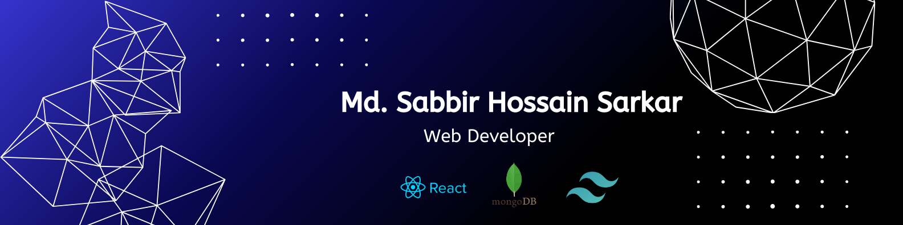

# 💫 About Me:
🔭 I’m currently working on Personal Projects
 👯 I’m looking to collaborate on frontend and MERN stack web development projects
 🤝 I’m looking for help with backend architecture, project scalability, and full-stack best practices
 🌱 I’m currently learning advanced React,Next.js, Node.js, Express, MongoDB, and AI/ML fundamentals
 💬 Ask me about Web development, React basics, and the MERN stack learning journey
 ⚡ Fun fact I enjoy building real projects 
 

## 🌐 Reach me out:
    

# 💻 Tools that I Know:
                               

# 📊 GitHub Stats:
 
 

